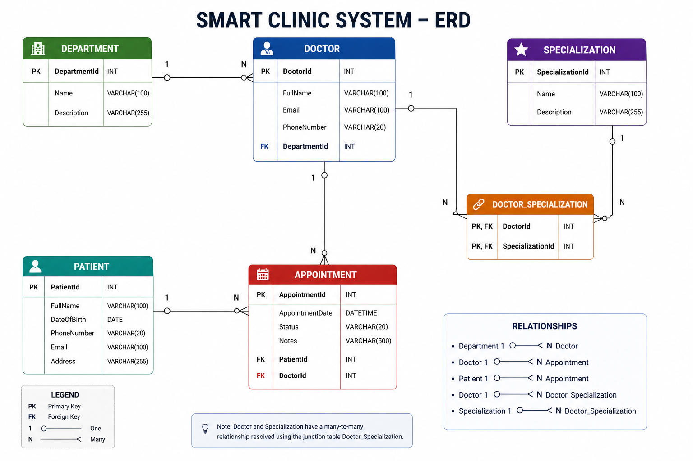

# Smart Clinic System

## Overview
Smart Clinic System is an ASP.NET Core RESTful API designed to help clinics manage patients, doctors, departments, and appointments.

The system allows clinic staff to:
- Manage patient records
- Manage doctors
- Assign doctors to departments
- Schedule and track appointments

## Technologies Used
- ASP.NET Core
- C#
- Entity Framework Core
- Azure SQL Database
- SQL Server
- Swagger
- xUnit
- EF Core InMemory Database

## Architecture
The project follows a layered architecture:

- Controllers: Handle HTTP requests and responses
- Services: Contain business logic
- Data: Contains the EF Core DbContext
- Models: Represent database entities
- DTOs: Control request and response data

## Main Features
- Create, read, update and delete patients
- Create, read, update and delete doctors
- Create, read, update and delete appointments
- Store data in Azure SQL Database
- Use DTOs for clean API input/output
- Unit tests for service layer methods

## Database Relationships
- Department has many Doctors
- Doctor has many Appointments
- Patient has many Appointments
- Doctor has many Specializations through DoctorSpecialization

## ERD


## API Endpoints
All endpoints follow RESTful conventions, including full CRUD operations (Create, Read, Update, Delete).

### Patients
- GET /api/Patients
- GET /api/Patients/{id}
- POST /api/Patients
- PUT /api/Patients/{id}
- DELETE /api/Patients/{id}

### Doctors
- GET /api/Doctors
- GET /api/Doctors/{id}
- POST /api/Doctors
- PUT /api/Doctors/{id}
- DELETE /api/Doctors/{id}

### Appointments
- GET /api/Appointments
- GET /api/Appointments/{id}
- POST /api/Appointments
- PUT /api/Appointments/{id}
- DELETE /api/Appointments/{id}

## Running the Project
```bash
dotnet restore
dotnet build
dotnet run